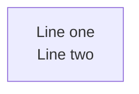
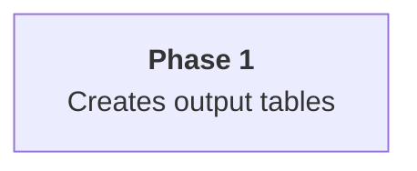
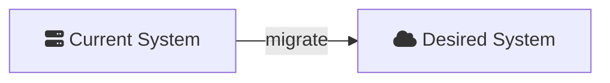

# Mermaid.JS Diagram Reference for Gap Analysis

Quick reference for writing and validating Mermaid diagrams embedded in gap analysis
markdown files. Distilled from the full `/mermaidjs_diagrams` skill.

## Rendering and Verification

mmdc exits non-zero if any mermaid fence fails to render. Use this as a validation gate.

```bash
INPUT="path/to/document.md"
INPUT_PATH="path/to/"
OUTPUT_BASE=".mmdc_cache"

# Variant 1: dark + transparent + PNG (default)
OUTPUT_FORMAT="png"
THEME=dark
BGCOLOR=transparent
VARIANT="${THEME}_${BGCOLOR}_${OUTPUT_FORMAT}"
OUTPUT_TARGET="${OUTPUT_BASE}/${VARIANT}/${INPUT_PATH}/"
OUTPUT="${OUTPUT_BASE}/${VARIANT}/${INPUT}"
npx -p @mermaid-js/mermaid-cli mmdc \
  -i "${INPUT}" \
  -a "${OUTPUT_TARGET}" \
  -o "${OUTPUT}" \
  --scale 4 -e "${OUTPUT_FORMAT}" -t "${THEME}" -b "${BGCOLOR}"

# Variant 2: default + white + PNG (for README, light-mode docs)
OUTPUT_FORMAT="png"
THEME=default
BGCOLOR=white
VARIANT="${THEME}_${BGCOLOR}_${OUTPUT_FORMAT}"
OUTPUT_TARGET="${OUTPUT_BASE}/${VARIANT}/${INPUT_PATH}/"
OUTPUT="${OUTPUT_BASE}/${VARIANT}/${INPUT}"
npx -p @mermaid-js/mermaid-cli mmdc \
  -i "${INPUT}" \
  -a "${OUTPUT_TARGET}" \
  -o "${OUTPUT}" \
  --scale 4 -e "${OUTPUT_FORMAT}" -t "${THEME}" -b "${BGCOLOR}"
```

**Exit code 0** = all diagrams valid. **Non-zero** = error on stderr with the offending fence.

## Choosing a Diagram Type

| Type | Best for | Notes |
|------|----------|-------|
| `flowchart LR` | Architecture, data flow, dependency graphs | Handles fan-out well, supports subgraphs |
| `flowchart TD` | Hierarchical/layered views | Top-down layout |
| `sequenceDiagram` | Interaction flows, API calls | Time-ordered message passing |
| `stateDiagram-v2` | State machines, workflows | Transitions and conditions |
| `architecture-beta` | Brand-logo diagrams, simple linear chains | Strict layout rules (see pitfalls) |

**Default choice for gap analysis: `flowchart LR`** — it's the most versatile and handles
the complex topology typical of current-vs-desired state comparisons.

## Common Pitfalls

### Multiline text in node labels

**`\n` does NOT work** — renders as garbled characters. Use `<br/>` instead:



For Mermaid v10.7+, markdown strings with real newlines also work:


`<br/>` does NOT work in subgraph labels or erDiagram — use short single-line titles.

### Unicode in node labels

Characters like U+21B3 (↳), U+2192 (→), U+00B7 (·) cause rendering failures in mmdc
even when they display correctly in browser previews. **Stick to ASCII-only text** in
node labels.

### architecture-beta edge rules

These are critical — violations produce silent failures (exit code 0, but error-bomb PNG):

1. **Edges MUST have labels.** `A:R -[label]-> L:B` works. `A:R --> L:B` silently fails.
2. **Direction goes BEFORE the rhs node id.** `A:R -[label]-> L:B` ✓ `A:R -[label]-> B:L` ✗
3. **One outgoing `R` edge per node.** Fan-out (one node → multiple `R` targets) causes
   collapsed/overlapping layout. Design as strict linear chains.
4. **`--iconPacks` required for CLI rendering.** Icons are not bundled. Pass
   `--iconPacks @iconify-json/logos @iconify-json/mdi` to mmdc.
5. **Only real npm packages work with `--iconPacks`.** The mechanism fetches from unpkg.com
   inside Puppeteer. Non-existent packages fail silently (empty icon boxes, exit code 0).

### Flowchart with Font Awesome icons

Flowchart diagrams using `fa:fa-icon` syntax need no `--iconPacks` flag:



## Variant Quick Reference

| Variant | Flags | Best For |
|---------|-------|----------|
| `dark_transparent_png` | `-e png -t dark -b transparent` | Dark UIs, slides (default) |
| `default_white_png` | `-e png -t default -b white` | README, light docs, print |
| `dark_transparent_svg` | `-e svg -t dark -b transparent` | Scalable dark docs |
| `default_white_svg` | `-e svg -t default -b white` | Scalable light docs |

## Diagram Guidance for Gap Analysis Sections

| Section | Recommended diagram types | Purpose |
|---------|--------------------------|---------|
| **Current State** | `flowchart LR`, `architecture-beta` | Show existing components, data flows, dependencies |
| **Desired State** | `flowchart LR`, `architecture-beta` | Show target components — visually distinguishable from Current State |
| **Gap Analysis** | `flowchart LR`, `stateDiagram-v2` | Show migration paths, dependency ordering, what changes between states |

**Tip:** Use consistent node IDs between Current State and Desired State diagrams so the
reader can visually diff what changed, what was added, and what was removed.

## Color Theming

**Full reference:** See `resources/color_theming.md`
for 4 complete palette recipes, HSL theory, and WCAG contrast compliance details.

### Critical Rules

1. **Always pair `fill:` with explicit `color:`** — Mermaid's default text color changes
   between light and dark themes. Without explicit `color:`, white text on a dark fill
   becomes invisible in light mode (or vice versa).

2. **Use hex colors only** — `#rrggbb` or `#rrggbbaa`. Named colors (`red`, `blue`)
   fail silently in some renderers (mmdc, GitHub).

3. **WCAG contrast** — white text (`#fff`) needs fill at Tailwind shade 600+ for AA
   compliance (4.5:1 ratio). Example: `#3b82f6` (blue-500) only achieves 3.1:1 — use
   `#2563eb` (blue-600, 4.6:1) or darker.

### HSL Encoding Channels

| Channel | Encodes | Example |
|---------|---------|---------|
| **Hue** | Category (nominal) | Blue=input, green=output, purple=process |
| **Saturation** | Importance (ordinal) | High=primary element, low=background |
| **Lightness** | Rank within category (ordinal) | Dark=primary, light=secondary |

### Gap Analysis Palette

Recommended `classDef` declarations for gap analysis documents. Each section gets a
distinct hue. Primary nodes use shade 600+ fills with white text; subgraph backgrounds
use 8-digit hex with low alpha (`22` = ~13% opacity).

```
%% Section hues — one per gap analysis section
classDef ovStyle   fill:#1e40af,stroke:#1e3a8a,color:#e0e7ff,stroke-width:2px  %% Overview: blue
classDef csStyle   fill:#b45309,stroke:#92400e,color:#fef3c7,stroke-width:2px  %% Current State: amber
classDef dsStyle   fill:#047857,stroke:#065f46,color:#d1fae5,stroke-width:2px  %% Desired State: emerald
classDef gaStyle   fill:#6d28d9,stroke:#5b21b6,color:#ede9fe,stroke-width:2px  %% Gap Analysis: violet
classDef smStyle   fill:#0e7490,stroke:#155e75,color:#cffafe,stroke-width:2px  %% Success Measures: cyan
classDef nmStyle   fill:#b91c1c,stroke:#991b1b,color:#fee2e2,stroke-width:2px  %% Negative Measures: red

%% Role hues — for workflow/agent diagrams
classDef userNode  fill:#f59e0b,stroke:#d97706,color:#1c1917,stroke-width:3px  %% Human: amber (dark text)
classDef agentNode fill:#2563eb,stroke:#1d4ed8,color:#eff6ff,stroke-width:2px  %% Agent: blue
classDef verifyNd  fill:#dc2626,stroke:#b91c1c,color:#fef2f2,stroke-width:2px  %% Verification: red
classDef validNode fill:#10b981,stroke:#059669,color:#ecfdf5,stroke-width:2px  %% Validation: green

%% Subgraph backgrounds — low alpha so nodes remain readable
style OV fill:#1e3a8a22,stroke:#1e40af,color:#93c5fd
style CS fill:#92400e22,stroke:#b45309,color:#fbbf24
style DS fill:#065f4622,stroke:#047857,color:#34d399
style GA fill:#5b21b622,stroke:#6d28d9,color:#a78bfa
style SM fill:#155e7522,stroke:#0e7490,color:#22d3ee
style NM fill:#991b1b22,stroke:#b91c1c,color:#f87171
```

### Three-Tier Hierarchy Per Category

Within a single hue family, vary fill darkness and stroke to encode importance:

| Tier | Fill | Text | Stroke | Use |
|------|------|------|--------|-----|
| **Primary** | Shade 600-800 | `#fff` | 2px solid, shade 800-900 | Key nodes, decisions |
| **Secondary** | Shade 300-400 | `#1e293b` | 1px solid, shade 500 | Supporting detail |
| **Background** | Shade 50-100 or `#xxxxxx22` | Shade 400-500 | 1px dashed, shade 200 | Subgraphs, grouping |

### Gotchas

- `stroke-dasharray` uses **spaces** not commas: `stroke-dasharray:5 5` (commas are
  `classDef` property delimiters)
- GitHub dark mode: default Mermaid theme arrows can vanish; custom `linkStyle` with
  explicit color helps
- Subgraph label color comes from the `color:` in the `style` directive, not from
  `classDef` — set it explicitly for each subgraph
