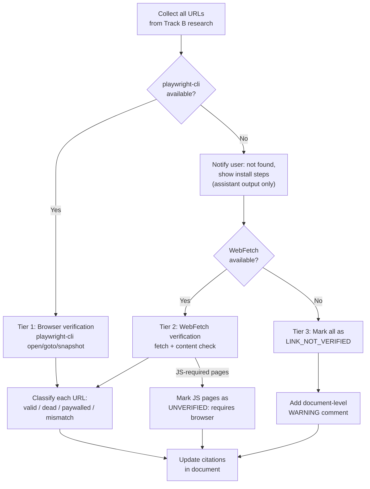

# Playwright CLI Reference for Link Verification

Reference for using `playwright-cli` to verify external URLs cited in gap analysis
documents. Covers availability detection, usage patterns, and the fallback chain when
the tool is not installed.

## Availability Detection

Before attempting browser-based link verification, check whether `playwright-cli` is
installed on the local system:

```bash
which playwright-cli && playwright-cli --version
```

| Result | Meaning | Action |
|--------|---------|--------|
| Exit 0, version printed | CLI available | Use full browser-based verification |
| Non-zero exit / command not found | CLI not installed | Fall back to Tier 2 (WebFetch) |

**When `playwright-cli` is not detected**, strongly encourage the user to install it
before proceeding. Browser-based verification catches JavaScript-rendered pages,
paywalls, and content mismatches that HTTP-only fetching cannot detect. Present the
installation options as **assistant output only** — do NOT write installation advice
into the planning document.

### Installation

`playwright-cli` is an open-source tool by Microsoft
([microsoft/playwright-cli](https://github.com/microsoft/playwright-cli),
[npm: @playwright/cli](https://www.npmjs.com/package/@playwright/cli)).
Two official installation methods:

```bash
# Option A: Homebrew (macOS / Linux)
brew install playwright-cli

# Option B: npm (any platform)
npm install -g @playwright/cli@latest
```

After installing, initialize the browser runtime:

```bash
playwright-cli install
```

### Example Assistant Output (when not detected)

When the detection check fails, output the following to the user (adapt as needed),
then **immediately proceed with the best available fallback tier** — do not wait for
user input. This is **conversation output only** — it must NOT be written into the
plan document.

> **Link verification: `playwright-cli` not found — falling back to WebFetch.**
>
> Browser-based verification (`playwright-cli`) is not installed on this system.
> Proceeding with HTTP-only verification via WebFetch. Pages that require JavaScript
> rendering will be marked `<!-- UNVERIFIED: requires browser rendering -->`.
>
> For future runs, you can install `playwright-cli` for full browser verification:
> ```bash
> # Homebrew
> brew install playwright-cli
>
> # or npm
> npm install -g @playwright/cli@latest
> ```
> Then run `playwright-cli install` to set up the browser runtime.
>
> After installing, re-run `/plan-gap <path>` and ask to retry link verification.

Do not block on user input. Detect once at the start of Step 1c, inform the user,
and proceed with the best available tier for the entire verification batch.

## Tier 1: Browser-Based Verification (playwright-cli)

For each external URL cited in the research:

```bash
# 1. Open a browser session (one session for all URLs)
playwright-cli open

# 2. Navigate to the URL
playwright-cli goto https://example.com/paper

# 3. Inspect page content
playwright-cli snapshot

# 4. Optionally capture visual proof
playwright-cli screenshot

# 5. Repeat steps 2-4 for remaining URLs

# 6. Close when done
playwright-cli close
```

### Verdict Classification

| Outcome | Action |
|---------|--------|
| Page loads, content matches assertion | Keep citation as-is |
| Dead link / 404 / 5xx | Remove citation, note it was unverifiable |
| Paywall / login wall | Keep citation, mark `<!-- PAYWALLED -->` |
| Content mismatch (page exists, wrong content) | Remove or correct the citation |
| JavaScript-rendered — content not in snapshot | Screenshot + manual review |

## Tier 2: WebFetch Verification

When `playwright-cli` is not available, use the built-in `WebFetch` tool:

```
WebFetch(url="https://example.com/paper")
```

**Capabilities:**
- Retrieve page content and verify the URL resolves (not 404/5xx)
- Check that the page content supports the asserted claim
- Detect paywalls and login walls from response content

**Limitations:**
- Cannot execute JavaScript — single-page apps may return empty shells
- Cannot interact with the page (no clicking, scrolling, or form filling)
- Cannot bypass authentication or cookie walls

**Verdict mapping:** Same classification as Tier 1, with one addition:
- If the page appears to require JavaScript rendering for its content, mark the
  citation `<!-- UNVERIFIED: requires browser rendering -->` instead of removing it.

## Tier 3: Unverified Markers

If both `playwright-cli` and `WebFetch` are unavailable or fail for a specific URL,
the citation MUST be annotated so readers know it was not independently confirmed.

### Per-link marker

```markdown
Source: [Paper Title](https://example.com/paper) <!-- LINK_NOT_VERIFIED -->
```

### Document-level warning

When **any** links could not be verified, add a warning comment at the top of the
document (immediately after the `# Title` heading):

```markdown
<!-- WARNING: N external link(s) could not be independently verified. Search for LINK_NOT_VERIFIED to review. -->
```

Update `N` as links are verified or confirmed unverifiable.

## Marker Reference

| Marker | Meaning |
|--------|---------|
| *(no marker)* | Link verified — page loads, content matches the assertion |
| `<!-- PAYWALLED -->` | Page exists but content is behind a paywall or login wall |
| `<!-- UNVERIFIED: reason -->` | Verification attempted but inconclusive — reason explains why |
| `<!-- LINK_NOT_VERIFIED -->` | No verification was possible — link assumed valid but unconfirmed |

## Decision Flow


