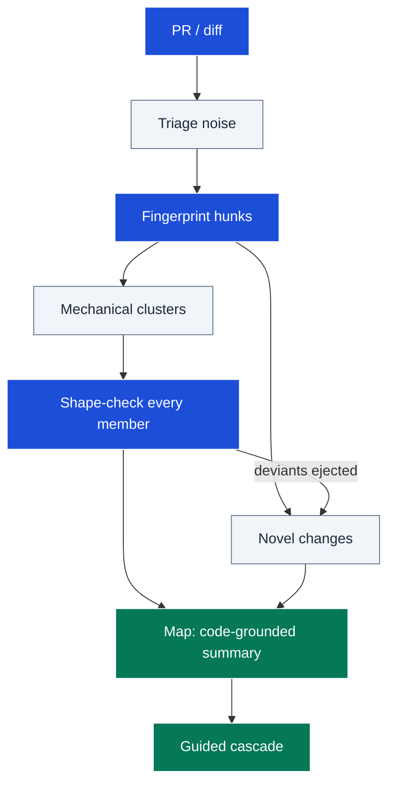
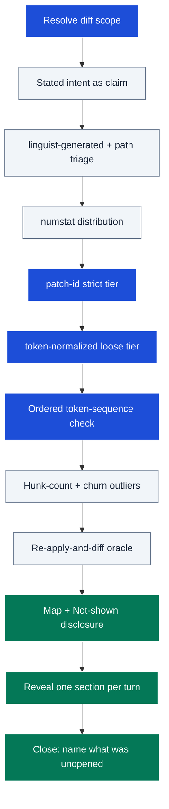

# prwalkthrough

Turns a pull request of any size — including 100s-1000s of changed files — into
its deeper structure: a handful of shape-checked mechanical change patterns
plus the few genuinely novel changes, then guides the reviewer through an
interactive cascade of detail they can end whenever satisfied. It exists
because a huge diff is unreviewable file-by-file by construction, but is
usually only 2-3 distinct changes in disguise.

## Table of Contents

<details><summary>Click to expand</summary>

<!--TOC-->

- [prwalkthrough](#prwalkthrough)
  - [Table of Contents](#table-of-contents)
  - [Quickstart](#quickstart)
  - [Architecture](#architecture)
  - [Reference](#reference)
    - [Troubleshooting](#troubleshooting)
  - [For maintainers](#for-maintainers)

<!--TOC-->

</details>

## Quickstart

In Claude Code:

```text
/prwalkthrough 11
/prwalkthrough walk me through the current branch
```

Driving the core clustering primitive directly (whitespace/position-insensitive
change fingerprints — files with the same hash got the same change):

```sh
MERGE_BASE=$(git merge-base origin/main HEAD)
for f in $(git diff --name-only $MERGE_BASE..HEAD); do
  printf '%s ' "$f"
  git diff $MERGE_BASE..HEAD -- "$f" | git patch-id --stable | cut -d' ' -f1
done | sort -k2 | uniq -c -f1 | sort -rn
```

Escape hatch — codemod-shape detection (uniform small churn = mechanical sweep):

```sh
git diff --numstat $MERGE_BASE..HEAD | sort -n | tail -20
```

## Architecture



The diff is fingerprinted into clusters; every cluster member is shape-checked
with an ordered token comparison (deviants get promoted to the novel set)
before the code-grounded map and the interactive reveal the reviewer paces.

<details><summary>Detailed flow</summary>



</details>

## Reference

- Operating manual (phases, output contract, loop rules):
  [SKILL.md](SKILL.md)
- Clustering algorithm (git commands, deviant detection):
  [resources/clustering.md](resources/clustering.md)
- Research evidence and citations:
  [resources/evidence.md](resources/evidence.md)

Requirements: `git` (and `gh` for PR-number invocations). No other tooling.

### Troubleshooting

| Symptom | Cause / fix |
|---------|-------------|
| Clusters look wrong — unrelated edits merged | Loose-tier normalization over-merged; check strict `patch-id` sub-clusters and present them separately. |
| Renamed files show as huge churn | Diff ran without `-M -C`; re-run with rename detection. |
| A "mechanical" cluster hid a real change | Phase 5 check was sampled or compared token *sets* — it must be exhaustive and ordered (bijection-mapped); check the `shape-checked` label and its stated scope. |
| Walkthrough feels confident but wrong | Stated intent was used as the frame; the map must lead with the code-grounded summary and flag intent discrepancies. |
| `gh pr diff` fails | Not authenticated or no remote PR; fall back to a local ref range. |
| Walkthrough floods the screen | The map comes first; sections expand only on request — re-anchor on the Phase 2 menu. |

## For maintainers

Design rationale, decision log, and extension checklist: [CLAUDE.md](CLAUDE.md).
