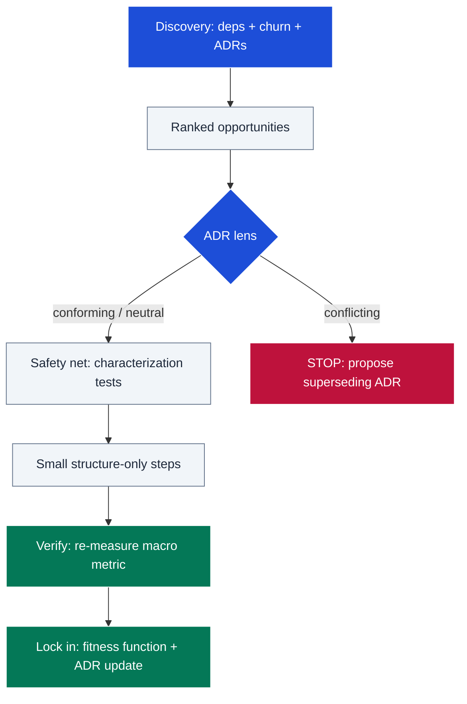

# refactor

Macro-level refactoring guided by evidence and project values. It maps the
system's dependency structure and churn hotspots, treats ADRs and recorded
decisions as the lens that directs (or vetoes) change, and executes
structure-only transformations in small, test-guarded, reversible steps. It
exists because unguided agents default to cosmetic renames while the payoff
lives at module boundaries, cycles, and hotspots.

## Table of Contents

<details><summary>Click to expand</summary>

<!--TOC-->

- [refactor](#refactor)
  - [Table of Contents](#table-of-contents)
  - [Quickstart](#quickstart)
  - [Architecture](#architecture)
  - [Reference](#reference)
    - [Troubleshooting](#troubleshooting)
  - [For maintainers](#for-maintainers)

<!--TOC-->

</details>

## Quickstart

In Claude Code:

```text
/refactor untangle the session datastore from the transport layer
/refactor            # no target: propose ranked opportunities
```

Driving the discovery signals directly — churn hotspot list (top candidates =
high count × high complexity):

```sh
git log --since="12 months ago" --name-only --pretty=format: \
  | grep -v '^$' | sort | uniq -c | sort -rn | head -20
```

Escape hatch — quick import-cycle check for a TypeScript area:

```sh
bunx madge --circular --extensions ts,tsx frontend/src
```

## Architecture



Every candidate passes through the ADR lens before any edit; conflicting
changes stop and escalate to a decision change rather than silently overriding
recorded rationale.

## Reference

- Operating manual (phases, ranking rules, when-NOT-to list, agent pitfalls):
  [SKILL.md](SKILL.md)
- Research evidence and citations: [resources/evidence.md](resources/evidence.md)

Requirements: `git`; language tooling for dependency graphs where available
(`bunx madge` for TS, `uv run` + import-linter style tools for Python) — the
skill degrades to grep-based mapping otherwise, and says so.

### Troubleshooting

| Symptom | Cause / fix |
|---------|-------------|
| Skill proposes only renames/cosmetic edits | Phase 1 ranking skipped; re-run discovery — hotspots, cycles, and ADR drift must rank above micro-smells. |
| Tests started failing mid-refactor | A step changed behavior; revert the step (one transformation per commit makes this cheap), never edit assertions. |
| "No ADRs found" | The repo has no `docs/adr/`; the lens degrades to CLAUDE.md/CONTEXT.md and design docs — neutral verdicts then need user confirmation for anything boundary-crossing. |
| Refactor "done" but nothing improved | Phase 5 re-measurement missing: the named macro metric (cycle count, fan-in, interface size) must move, or the work is churn. |
| Public consumer broke after a move | Exported-surface inventory (Phase 0.4) skipped — serialization, DI wiring, routes, and reflection targets aren't visible in import graphs. |

## For maintainers

Design rationale, decision log, and extension checklist: [CLAUDE.md](CLAUDE.md).
