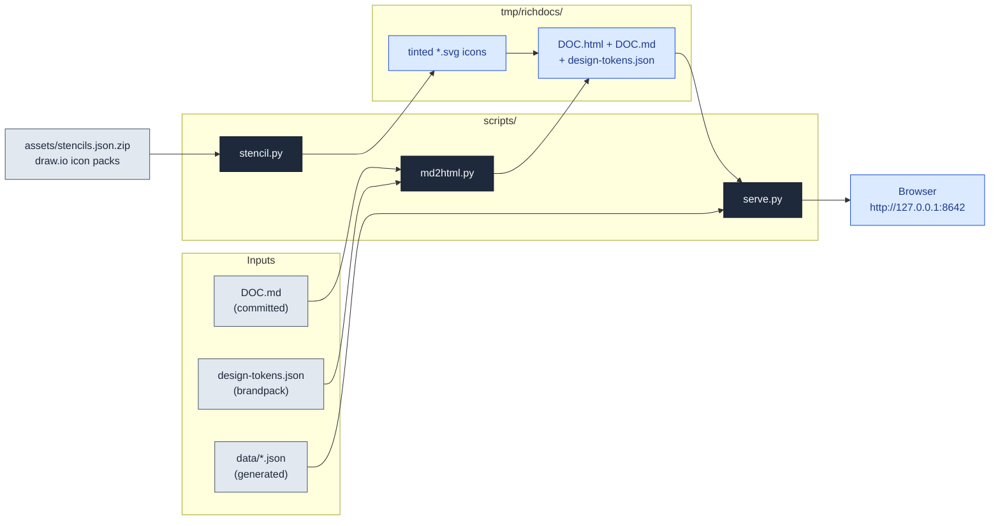

# richdocs

Generate rich, interactive HTML companions to markdown discovery documents —
and serve them reliably on localhost. The markdown stays the committed source
of truth; the companion adds theme-aware mermaid, data-driven cytoscape
graphs and plotly charts, tinted cloud-provider icons from a vendored stencil
library, and an injectable design-tokens brandpack.

## Architecture



## Quickstart

**In Claude:**

```
/richdocs TARGET_ARCHITECTURE.md
```

**Direct scripts (from repo root, never `cd`):**

```bash
uv run --no-project .claude/skills/richdocs/scripts/md2html.py TARGET_ARCHITECTURE.md
uv run --no-project .claude/skills/richdocs/scripts/serve.py tmp/richdocs --open
```

**Escape hatch (one shareable file, no server):**

```bash
uv run --no-project .claude/skills/richdocs/scripts/md2html.py REVIEW.md --inline
open tmp/richdocs/REVIEW.html
```

## Reference

| Piece | What it does |
|-------|--------------|
| `scripts/md2html.py` | Markdown → HTML companion; multi-file live mode or `--inline` single file |
| `scripts/serve.py` | `127.0.0.1` server with `Cache-Control: no-store`; fixes `file://` fetch blocking |
| `scripts/stencil.py` | Query/extract tinted SVG icons from the vendored draw.io packs |
| `assets/stencils.json.zip` | AWS/GCP/Azure/K8s icon library (`assets/NOTICE` for provenance) |
| `assets/design-tokens.json` | Default neutral brandpack — edit the copy in the output dir to re-skin |
| `resources/*.md` | Deep dives: serving, stencils, rich blocks, discovery-doc recipes |

Fenced ` ```cytoscape ` and ` ```plotly ` blocks inside the markdown render
as interactive canvases; a block body of `{ "data": "path.json" }` pulls an
external data file at refresh time. See `resources/rich-blocks.md`.

## Troubleshooting

| Symptom | Cause → fix |
|---------|-------------|
| Blank page, console shows `CORS`/`file://` fetch error | Opened multi-file output directly → run `serve.py`, or regenerate with `--inline` |
| Edits to the `.md` don't show | Editing the *source* doc, not the copy in the output dir → re-run `md2html.py`, or edit `tmp/richdocs/<stem>.md` |
| Dark page with white charts | Forked template dropped the canvas re-theme → theme flips must restamp `data-theme` AND re-feed canvas palettes |
| `stencil.py extract` exits 1 | Unknown id (they contain spaces — quote it); use the suggested close matches |
| Port busy error | Another `serve.py` running → different `--port`, or reuse the running one |
| Charts empty offline | CDN libs unreachable → network required; blocks degrade to visible code/error, never silently |

## For maintainers

Design rationale, ADR log, and gotchas: [`CLAUDE.md`](CLAUDE.md). Dev loop:
`make -C .claude/skills/richdocs/scripts fix ci`.
