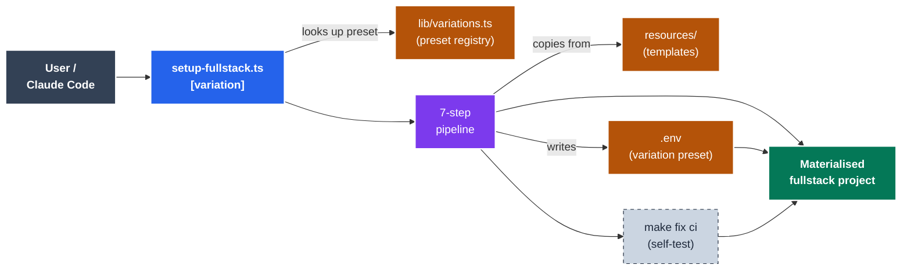
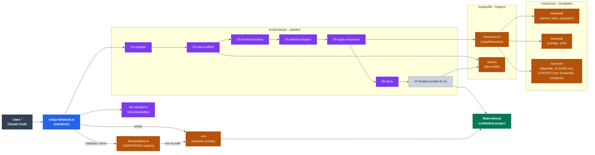
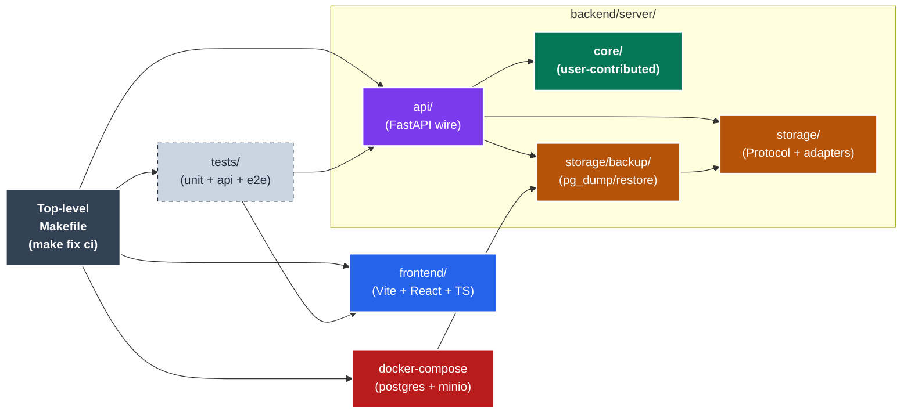
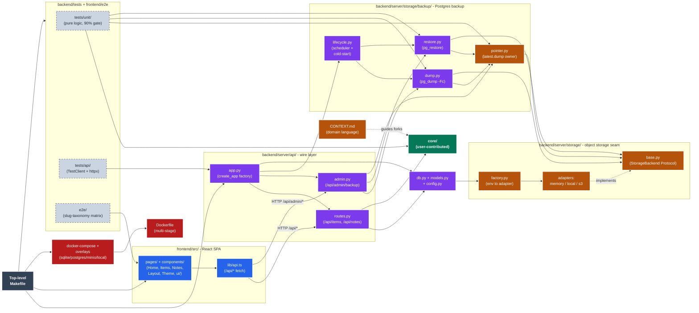

# Setup Fullstack Skill

Automated setup script for a fullstack web application — Python (FastAPI + uv) backend served alongside a React (Vite + TypeScript) frontend, with a top-level Makefile that orchestrates both halves.

## Architecture

Two lenses: the **scaffolder** (this skill — the Bun CLI + resource tree that produces a project) and the **scaffolded output** (the project that lands on disk). Each has a simplified always-visible diagram and a detailed reference in the collapsible block.

### Lens 1 — The scaffolder



*Simplified — user runs `setup-fullstack.ts [variation]`. The CLI looks up the variation's env-var preset, runs the 7-step pipeline over the resource tree, writes `.env` with the preset, then self-verifies via `make fix ci`.*

<details>
<summary>📋 Detailed scaffolder diagram (19 nodes)</summary>



</details>

### Lens 2 — The materialised scaffold



*Simplified — top-level Makefile orchestrates frontend, backend (api / core / storage / storage-backup), tests, and the dockerised postgres+minio stack. The user-contributed surface (`server/core/`) is highlighted; everything else is framework-managed.*

<details>
<summary>📋 Detailed scaffold diagram (21 nodes)</summary>



</details>

**Reading the colors**: `core/` (green) is **user-contributed** — the surface a fork fills with its own domain logic. Everything else under `backend/server/` (violet/amber) is **framework-managed** — code the scaffold owns and forks generally inherit unchanged. The amber tier (`storage/`, `storage/backup/pointer.py`) is the data-plane seam; the red tier (`Dockerfile`, `docker-compose`) is the external runtime. See `CONTEXT.md` (shipped into every scaffolded project) for the canonical glossary.

## What it includes

### Frontend (sibling `frontend/` directory)
- **Vite** — next-generation frontend tooling
- **React 19** with **TypeScript** (strict family enabled — `strict`, `noUncheckedIndexedAccess`, `exactOptionalPropertyTypes`, `noImplicitOverride`, `noPropertyAccessFromIndexSignature`)
- **Tailwind CSS v4** — utility-first CSS framework via `@tailwindcss/vite` (no `tailwind.config.js`)
- **shadcn/ui** — re-usable component library
- **Biome** — single tool for lint + format + import organization (`biome ci` enforces warnings-are-errors)
- **Vitest** — fast unit testing framework with **≥90% coverage threshold** (lines + functions + branches + statements)
- **Playwright** — end-to-end testing with the **slug-taxonomy + coverage-matrix** pattern; webServer spawns BOTH halves via `concurrently`
- **bun** as the runtime + package manager
- Path alias `@/*` → `./src/*`

### Backend (sibling `backend/` directory)
- **FastAPI** with a `create_app()` factory pattern
- **uvicorn** with `factory=True` and `--reload`
- **Pydantic v2** for request/response schemas (with the `pydantic.mypy` strict plugin)
- **uv** as the package + virtualenv manager
- **ruff** — selects `E, W, F, I, B, C4, UP, RUF, SIM, ARG, N, S, PT` (warnings-are-errors)
- **mypy strict** — over `server/` AND `tests/`
- **pytest** with `--cov-fail-under=90` enforced; split into `tests/unit/` (pure-logic) and `tests/api/` (TestClient integration)
- Pure-logic `server/core/` boundary — NO FastAPI imports leak into core

### Top-level orchestration
- **Makefile** with per-language rollup targets — `format-ts`/`format-py`, `lint-ts`/`lint-py`, `typecheck-ts`/`typecheck-py`, `test-ts`/`test-py`, all rolling up into `format`, `lint`, `typecheck`, `test`
- **Canonical inner-loop**: `make fix ci`
- **Dual port profiles**: `make dev` (5173 + 8200, human) vs `make agentic-dev` (5174 + 8201, AI agent)
- **GitHub Actions** workflow — `bun install --frozen-lockfile` + `uv sync --frozen` + `make ci` + Playwright browser cache + e2e artifact upload on failure

## Usage

### From the command line

```bash
# Scaffold with the default variation (sqlite-memory)
bun .claude/skills/setup-fullstack/scripts/setup-fullstack.ts

# Scaffold with a specific variation — its env-var bundle is written to .env
# so `make docker-up` / `make ci` pick that combo out of the box.
bun .claude/skills/setup-fullstack/scripts/setup-fullstack.ts postgres-aws-backup
bun .claude/skills/setup-fullstack/scripts/setup-fullstack.ts sqlite-persisted

# Discover available variations
bun .claude/skills/setup-fullstack/scripts/setup-fullstack.ts list-variations

# Help
bun .claude/skills/setup-fullstack/scripts/setup-fullstack.ts --help
```

The variation argument is a **config preset** — it determines what env vars land in the scaffolded `.env` file. The scaffold output supports every variation at runtime (via the docker-compose overlay system); the variation arg just chooses the default.

Testing each variation against the scaffolded project is **not** the CLI's job. The bash harness at `tmp/test-matrix.sh` + `tmp/test-variation.sh` exercises the variation matrix against a scaffolded project from outside the skill.

### From Claude Code

Ask Claude to "set up a new fullstack web app" or "scaffold a Python backend with a React frontend".

## What the script does

The script runs sequentially, mostly silent except for the `Step N:` banners.

### Frontend half (mirrors `vite-react-setup`)
1. Snapshots existing `README.md` / `CONTRIBUTING.md` so they aren't clobbered.
2. Creates `backend/` and `frontend/` sibling directories.
3. Scaffolds Vite + React + TypeScript into `frontend/` (`bun create vite@latest frontend --template react-ts`).
4. Installs base dependencies (`bun install`).
5. Adds Tailwind v4, shadcn/ui dependencies, Vitest + Testing Library, jsdom, `@vitest/coverage-v8`, `@playwright/test`, `concurrently`, Biome.
6. Strips the scaffold's ESLint deps + `eslint.config.js`, then `biome init`.
7. Patches `vite.config.ts` (Tailwind plugin, React plugin, `@/*` alias, `/api` proxy reading `API_PORT` from env, Vitest with ≥90% coverage thresholds).
8. Patches `tsconfig.json` AND `tsconfig.app.json` with the strict family + `@/*` paths.
9. Patches `biome.json` (excludes build/test/scratch dirs, enables Tailwind directive parsing).
10. Writes `playwright.config.ts` whose `webServer` block invokes `bun run agentic-dev` (so e2e exercises both halves at once, on the agent ports, in parallel-safe mode).
11. Writes `e2e/matrix.ts` (axis arrays) + `e2e/routes.spec.ts` (generated tests with three artifacts per slug).
12. Updates `frontend/package.json` scripts: adds `concurrently`-driven `dev` + `agentic-dev`, plus `lint` (= `biome ci .`), `lint-fix`, `format`, `format-check`, `test`, `test:e2e`.
13. Initializes shadcn/ui (`bunx --bun shadcn@latest init -d`).
14. Writes a small `frontend/Makefile` that exposes the targets the top-level Makefile delegates to.

### Backend half
15. Writes `backend/pyproject.toml` (FastAPI, uvicorn, pydantic, ruff strict, mypy strict, pytest with `--cov-fail-under=90`).
16. Writes `backend/server/__main__.py` (argparse + `uvicorn.run(..., factory=True)`).
17. Writes `backend/server/api/{app.py, routes.py, schemas.py}` (factory + `/api/health` + `/api/echo` with Pydantic v2 schemas).
18. Writes `backend/server/core/__init__.py` (pure-logic placeholder used by `/api/echo`).
19. Writes `backend/tests/{conftest.py, unit/test_core.py, api/test_routes.py}`.
20. Writes `backend/Makefile` with `install`/`dev`/`agentic-dev`/`format`/`format-check`/`lint`/`lint-fix`/`typecheck`/`test`/`clean`.
21. `uv sync` in `backend/` to materialise the venv.

### Top-level
22. Writes the top-level `Makefile` (per-language rollup targets, `make fix ci` inner-loop, port management).
23. Writes `.gitignore` covering both Python and Node/Bun outputs.
24. Writes `.github/workflows/build.yml`.
25. Writes `README.md` (user-facing) and `CONTRIBUTING.md` (developer-facing) — only if they don't already exist.

### Verification
26. Runs `make fix ci` from the project root to verify everything compiles, lints clean, typechecks strict, tests pass with ≥90% coverage, and the e2e smoke test loads the home route.

## Test matrix slug pattern

```
test-results/matrix/home__default.png           # full-page screenshot
test-results/matrix/home__default.log           # console + page errors (filtered)
test-results/matrix/home__default.network.json  # request timings sorted by start offset
```

To add a route: append a slug to `SECTIONS` in `e2e/matrix.ts`. Done. Each entry automatically gets navigate → wait → assert no console errors → screenshot + log + network capture.

To grow a new axis (locales, viewport sizes, auth states): copy `VARIANTS` and weave it into the `MATRIX` flatMap.

## After setup

```bash
# Inner-loop (run before committing):
make fix ci

# Dev:
make dev             # backend 8200 + frontend 5173 (human profile)
make agentic-dev     # backend 8201 + frontend 5174 (AI agent profile)

# Narrow inner-loops:
make test-py         # backend pytest only
make test-ts         # frontend vitest only
make typecheck-py    # mypy only
make typecheck-ts    # tsc only
make test-e2e        # Playwright (auto-launches both halves via concurrently)

# Discover everything:
make help
```

## Why these specific choices

- **`bun create vite` over `npm create vite`** — keeps the project on a single package manager from scaffold onwards.
- **`uv` over `pip` / `poetry` / `hatch`** — fastest install, modern lockfile (`uv.lock`), single binary; matches the project's Python rules.
- **`hatchling` build backend** — modern, simple, default for pyproject-only Python packages.
- **`uvicorn(..., factory=True)`** — tests can build isolated `FastAPI` instances per fixture; module-level singleton would leak state across tests.
- **`server.core` pure module** — the surface that the ≥90% coverage gate must load on. FastAPI lives only in `server.api`.
- **`tests/unit` vs `tests/api`** — coverage gate applies primarily to `server.core` (deterministic) while API tests verify wiring; the split keeps the coverage denominator from being inflated by framework glue.
- **`concurrently` in `package.json` (not `make -j`)** — `concurrently -k` produces prefixed/colored logs and a single Ctrl-C tears down both processes cleanly. `make -j` interleaves output and orphans children on interrupt.
- **Both backend AND frontend ports split** — a shared backend means only one dev session can run at a time; the entire point of `agentic-dev` is parallel iteration with a human.
- **Biome's `biome ci` over `biome lint`** — fails on warnings and format drift, not just errors. Same command runs in CI.
- **Vitest coverage thresholds** — fails the build if coverage drops below 90% on lines, functions, branches, OR statements.
- **`pytest --cov-fail-under=90`** — same gate, same number, on the Python half.

## Requirements

- bun 1.2+ (for the text lockfile, `bun create vite`, `Bun.$`)
- uv 0.5+ (for `uv sync --frozen` and the `pyproject.toml` `[dependency-groups]` syntax)
- Python 3.12+

## Notes

- Action versions in the generated workflow are pinned to current majors. Bump in routine maintenance.
- The script verifies build + lint + typecheck + test + e2e before completing — a green setup means a deployable scaffold.
- The frontend half is a whole copy of the `vite-react-setup` skill's output, not a runtime delegation. Both skills evolve independently.
