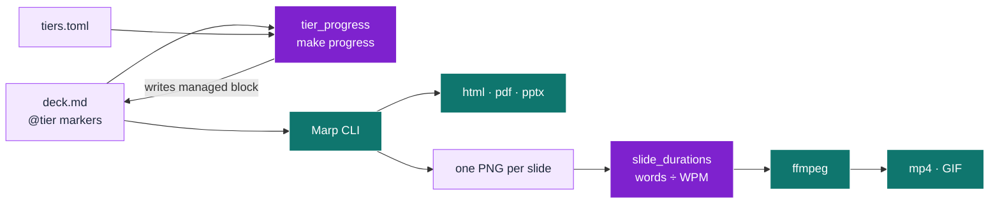
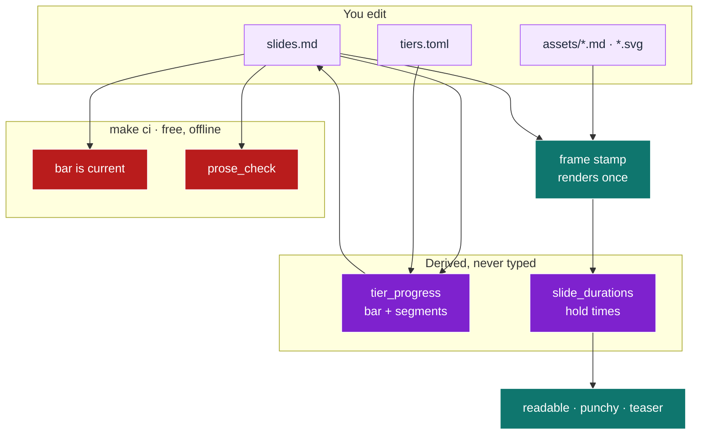

# slides

Turns a Markdown file into a presentation: HTML, PDF, PowerPoint, and a
self-running mp4 or GIF whose per-slide timing is computed from each slide's word
count. It exists because the parts of a deck that a human maintains by hand are
the parts that rot: a progress bar's fractions and a GIF's frame timings are both
wrong the moment a slide moves, and neither failure is visible.

<details>
<summary>Table of contents</summary>

<!--TOC-->

- [slides](#slides)
  - [Quickstart](#quickstart)
  - [Architecture](#architecture)
  - [What the scaffold writes](#what-the-scaffold-writes)
  - [Reference](#reference)
    - [Requirements](#requirements)
    - [Commands](#commands)
    - [Example: an audience-tiered deck](#example-an-audience-tiered-deck)
    - [Troubleshooting](#troubleshooting)
  - [For maintainers](#for-maintainers)

<!--TOC-->

</details>

## Quickstart

In Claude:

```
/slides make a deck for this repo, themed from our design tokens
```

Driving the script directly, from the repo root:

```bash
# Scaffold a self-contained deck (theme derived from the project's tokens)
uv run --no-project .claude/skills/slides/scripts/scaffold_deck.py \
  --out docs/slides --name product-pitch --tokens frontend/src/design-tokens.json \
  --tiers my-tiers.toml   # optional: your audiences, else a sensible 4-tier default

# See every layout available, rendered as a real deck
make -C docs/slides template

# Build
make -C docs/slides html     # fastest; no browser needed
make -C docs/slides gif      # frames -> per-slide timing -> mp4 -> GIF
make -C docs/slides ci       # free, offline gate: bar current, prose clean
```

The escape hatch, when you want a pacing that is not one of the three profiles:

```bash
make -C docs/slides gif WPM=220 SLIDE_MAX=8 GIF_HEIGHT=360
```

## Architecture

One marker per slide drives the bar. One word count per slide drives the timing.



<details>
<summary>The full build, including the gates and the media variants</summary>



The frame stamp is why three pacing variants cost one browser render rather than
three. Both derived steps refuse rather than guess: an out-of-order tier stops the
build, and a frame/slide mismatch refuses to emit a pacing playlist.

</details>

## What the scaffold writes

A deck that depends on nothing outside its own directory, **including this skill**.
The helper scripts are copied in rather than referenced, so the deck keeps
building if the skill is deleted, and a consumer can edit them without editing a
skill.

```
docs/slides/
├── Makefile              # build / render / media / ci. `make help` lists all
├── slides.md             # the deck. Edit this
├── master-template.md    # buildable reference: every layout, with its source
├── tiers.toml            # the audiences, in the order the deck addresses them
├── themes/<name>.css     # theme; palette derived from the project's tokens
├── assets/               # diagram sources and images the deck embeds
└── scripts/              # tier_progress · slide_durations · prose_check
```

## Reference

### Requirements

| Need | For |
|---|---|
| `bun` (provides `bunx`) | everything; fetches the pinned Marp CLI from npm on first run |
| `uv` | the helper scripts (stdlib-only; `uv` is just the launcher) |
| Chrome or Chromium | PDF, PPTX, diagram rendering, and the video/GIF frames |
| `ffmpeg` | `make video`, `make gif`, `make variants` only |
| LibreOffice (`soffice`) | `make pptx-editable` only |

No install step and no committed `node_modules`. Nothing here calls a paid API or
a model: every gate is free, offline and deterministic.

### Commands

`make -C <deck> help` lists every target. `SKILL.md` carries the full option
surface for the scripts. The three that matter:

```bash
make -C docs/slides progress   # derive the bar from the @tier markers
make -C docs/slides template   # the buildable layout reference
make -C docs/slides ci         # gate: bars current, prose clean
```

### Example: an audience-tiered deck

Declare the audiences once, in the order the deck addresses them:

```toml
# tiers.toml
[[tier]]
name = "exec"
label = "Executives: the business case and the ask"
colour = "#4c9f70"

[[tier]]
name = "ic"
label = "Individual contributors: the implementation detail"
colour = "#9d7bd8"
```

Tag each slide with one marker (an HTML comment wrapping `@tier exec`), then run
`make progress`. The bar's fractions **and** its segments are generated, so
changing from four tiers to two needs no CSS edit:

```
  slide  tier      progress  bar
      2  exec         25.0%  #####...............
      3  exec         50.0%  ##########..........
      4  ic           75.0%  ###############.....
      5  ic          100.0%  ####################
```

### Troubleshooting

| Symptom | Cause and fix |
|---|---|
| `tier 'x' follows 'y', out of the declared order` | The deck runs top-down. Reorder the slides, or reorder `tiers.toml`. |
| `progress block is STALE` in `make ci` | Markers changed without a regen. Run `make progress`, commit the result. |
| The bar reads empty on every slide | No `@tier` markers, or the generated block was hand-deleted. Run `make progress`. |
| Edited a slide, the GIF still shows the old one | Something the deck embeds is not a prerequisite of the frame stamp. Add it to the Makefile's `SVG_SRC`/`MMD_SRC`. |
| `frame/slide mismatch` from the pacing script | A `---` inside a fenced code block was counted as a break, or frames are stale. Re-run `make frames`. |
| A mermaid block renders as a code listing | Marp has no Mermaid runtime. Move it to `assets/<name>.md` and `make diagrams`. |
| `error: ffmpeg is required` | Only the video and GIF targets need it. `brew install ffmpeg`, or build `html`/`pdf` instead. |
| Prose gate fails on a word you meant to name | Quote it. A code span is a mention, not a use. |
| `unknown tier(s) [...]` after editing `tiers.toml` | The starter decks are tagged with the old names. Retag the markers, or re-scaffold with `--tiers`. |

## For maintainers

The development contract, the decision log and the extension checklist live in
[CLAUDE.md](CLAUDE.md). The short version: `make -C .claude/skills/slides/scripts
fix` then `... ci`, and `ci` must be green before handoff.
